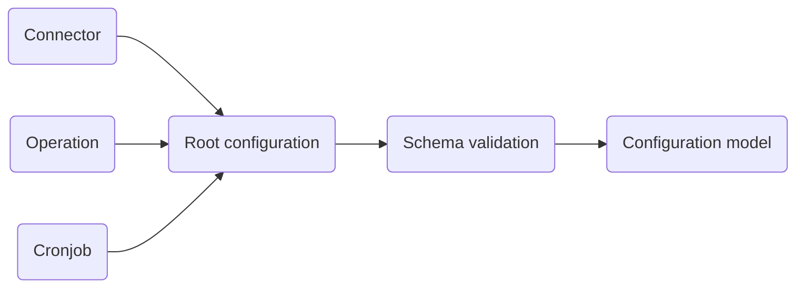
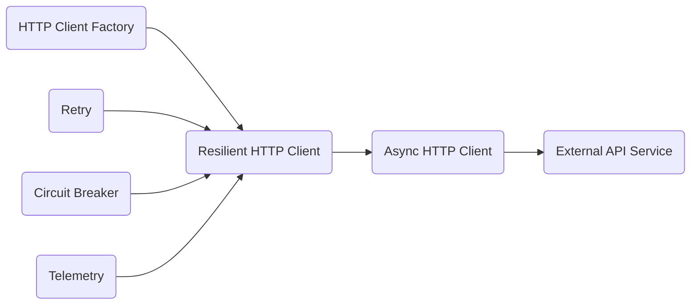

# pycraftcore

`pycraftcore` is a reusable technical infrastructure library for Python applications: configuration loading, HTTP
clients with retries/circuit-breaking/tracing, a pooled async SQLite repository, a sandboxed Python code runner, safe
SQL validation, serialization, and a handful of other adapters — all built as small, swappable ports/adapters rather
than a framework.

**Design principles:** Modularity · Reusability · Maintainability

---

## Table of Contents

- [Features](#features)
- [Installation](#installation)
- [Usage Examples](#usage-examples)
    - [Application Configuration](#application-configuration)
    - [Resilient HTTP Client](#resilient-http-client)
    - [Sandboxed Python Execution](#sandboxed-python-execution)
    - [Safe SQL Validation](#safe-sql-validation)
    - [Pooled SQLite Repository](#pooled-sqlite-repository)
- [Development](#development)

---

## Features

| Module                    | Description                                                                                                       |
|----------------------------|--------------------------------------------------------------------------------------------------------------------|
| **Configuration Management** | Environment-driven YAML config (connector/operation/cronjob), `${oc.env:...}` variable injection, typed/validated models |
| **Authentication**         | Typed auth models (none / basic / token) shared across connector configs                                          |
| **Logging**                 | Singleton structured logger over loguru, behind a `Logger` port                                                   |
| **Telemetry & Observability** | OpenTelemetry-backed tracing: span decorator, request-id enrichment, console or OTLP export                     |
| **HTTP Client Utilities**   | `aiohttp`/`httpx` clients behind a common port, retry policy, circuit breaker, and a `ResilientClient` composing all three with tracing |
| **Repository / SQLite**     | Async SQLite repository with a real connection pool (WAL mode, `busy_timeout`) — not just an async-wrapped single connection |
| **Query Language / SQL Safety** | `sqlglot`-based parser that rejects any non-read-only statement (INSERT/UPDATE/DELETE/DROP/...) before it reaches a database |
| **Runtime / Sandboxed Execution** | Runs arbitrary Python in a separate OS process with an import allowlist, memory/CPU limits, and a timeout |
| **Serialization**           | JSON, dict, and binary (msgpack) serialization for dataclasses                                                    |
| **Scientific computation engine** | NumPy/SciPy-backed arithmetic (log returns, rolling average/stddev) and calculus (integration, interpolation) operations |
| **File handler**            | Extension-based read/write strategy (currently YAML), pluggable for more formats                                  |
| **Profiler**                 | `pyinstrument`-based async function profiling decorator                                                            |

Every module follows the same shape: a `port/` package with `Protocol` interfaces and an `adapter/` package with one
or more concrete implementations, so consumers depend on the port, not the adapter.

---

## Installation

**Stable release** (recommended for production):

```bash
pip install pycraftcore
```

**Development build** (latest features, may be unstable):

```bash
pip install -i https://test.pypi.org/simple/ pycraftcore
```
> [!WARNING]
> The development build is intended for testing only and should **not** be used in production.

---

## Usage Examples

### Application Configuration

Services are configured using YAML files combined with environment variables.

#### Architecture



#### Environment Variables

| Variable                   | Description                      |
|-----------------------------|-----------------------------------|
| `APP_ENV`                   | Application environment          |
| `CONFIGURATION_DIR`         | Root configuration directory     |
| `<CONNECTOR_NAME>_API_KEY`  | API key for a specific connector |
| `DB_HOST`                   | Database host                    |
| `DB_PORT`                   | Database port                    |
| `DB_NAME`                   | Database name                    |
| `DB_USER`                   | Database username                |
| `DB_PASSWORD`               | Database password                |

#### Directory Structure

| Path         | Description                                 |
|--------------|----------------------------------------------|
| `connector/` | Data source connector definitions           |
| `operation/` | Retrieval operations and business use cases |
| `cronjob/`   | Scheduled job definitions                   |
| `root.yml`   | Root application configuration              |

**Example layout:**

```
<env>/
├── connector/
│   ├── api.yml
│   ├── database.yml
│   ├── file.yml
│   └── telemetry.yml
├── operation/
│   └── intraday_stock.yml
└── root.yml
```

#### YAML Configuration Reference

**Connector** (`connector/<tag>.yml`)

```yaml
connector:
  <connector_tag>:
    name: <connector name>
    type: api
    base_url: <base url>
    timeout: 5
    retry: 3
    auth:
      type: token
      key_name: apikey
      key_value: ${oc.env:connector_api_key}
```

A SQLite database connector additionally takes a `pool` block controlling how many pooled connections the repository
opens (see [Pooled SQLite Repository](#pooled-sqlite-repository)):

```yaml
connector:
  <connector_tag>:
    name: <connector name>
    type: database
    engine: sqlite
    host: <path to the sqlite data directory>
    default_name: <database file name, without extension>
    pool:
      max: 4
    auth:
      type: none
```

**Operation** (`operation/<tag>.yml`)

```yaml
operation:
  <operation_tag>:
    name: <operation name>
    connector: ${connector.connector_tag}
    endpoint: <endpoint>
    method: GET
    parameters:
      <parameter1>: <value1>
      <parameter2>: <value2>
```

#### Loading it

```python
from pathlib import Path

from pycraftcore.application_configuration.adapter.load_application_configuration import (
    LoadApplicationConfiguration,
)
from pycraftcore.application_configuration.adapter.omega_configuration_reader import (
    OmegaConfigurationReader,
)
from pycraftcore.application_configuration.enum.run_type_environment import RunTypeEnvironment
from pycraftcore.logger.adapter.loguru_logger import LoguruLogger

reader = OmegaConfigurationReader(RunTypeEnvironment.production, Path("config"))
loader = LoadApplicationConfiguration(reader, LoguruLogger())

config = loader.load()  # cached after the first successful read
config = loader.reload()  # forces a fresh read
```

---

### Resilient HTTP Client

This example builds a fault-tolerant async HTTP client with retry logic, circuit breaking, and observability.

#### Architecture



#### Complete Example

```python
from pycraftcore.http.adapter import (
    AioHttpClientFactory,
    CircuitBreakerPolicy,
    ResilientClient,
    RetryPolicy,
)
from pycraftcore.http.configuration import CircuitBreakerSettings, HttpClientSettings, RetrySettings
from pycraftcore.telemetry.adapter.open_telemetry import OpenTelemetryProvider

settings = HttpClientSettings()
settings.client_params.base_url = "<base url>"

# The factory owns the underlying session/connector lifecycle; the client it hands out is
# a thin, stateless get/post wrapper over that session.
client_factory = AioHttpClientFactory(http_client_settings=settings)
await client_factory.start()
base_client = client_factory.create_client()

# Retry policy
retry_policy = RetryPolicy(RetrySettings(retry_count=3, retry_delay=1.0))

# Circuit breaker
circuit_breaker = CircuitBreakerPolicy(
    CircuitBreakerSettings(failure_threshold=2, recovery_timeout=30)
)

# Telemetry via OpenTelemetry
telemetry_provider = OpenTelemetryProvider(service_name="<external api name>")
tracer = telemetry_provider.tracer("<external api name>")

# Compose the resilient client — get/post are wrapped once at construction time with
# tracing, then the retry decorator, then the circuit breaker.
client = ResilientClient(
    base_client=base_client,
    circuit_breaker=circuit_breaker,
    retry_policy=retry_policy,
    trace_manager=tracer,
)


async def fetch_intraday_stock() -> None:
    try:
        params = {
            "function": "<function name>",
            "symbol": "<stock symbol>",
            "interval": "<time interval>",
            "apikey": "<api key>",
        }

        response = await client.get("/<endpoint>", params=params)
        print(response)

    finally:
        # ResilientClient has no lifecycle of its own — close whatever built base_client.
        await client_factory.close()
        telemetry_provider.shutdown()
```

`HttpxClientFactory` is a drop-in alternative to `AioHttpClientFactory`: same `start()`/`create_client()`/`close()`
shape, plus a `resilient_client_instance` property that wraps its own transport in retry + circuit-breaking directly
(an alternative to composing `ResilientClient` by hand as above).

---

### Sandboxed Python Execution

Runs arbitrary Python code in a separate process with an import allowlist, a memory ceiling (`RLIMIT_AS` on Linux), a
CPU-time limit, and a hard timeout. The child process has no access to the parent's file descriptors, environment
beyond `PYTHONDONTWRITEBYTECODE`/`PYTHON_COLORS`, or globals.

```python
from pycraftcore.runtime.python.factory import SafeCodeFactory
from pycraftcore.runtime.python.schema import SafeCodeSettings

factory = SafeCodeFactory(SafeCodeSettings(code_timeout=10, max_memory_mb=256))

code = factory(code="result = sum(range(100))")
output = await code.execute()

print(output.stdout)  # {"__type__": "int", "result": 4950}
print(output.stderr)  # "" on success, an error/timeout message otherwise
```

The executed code must assign its final value to a variable named `result`; only modules in
`pycraftcore.runtime.python.adapter.ALLOWLIST` (`math`, `statistics`, `datetime`, `re`, `json`, `collections`,
`itertools`, `functools`, `pandas`, `numpy`, `matplotlib`) can be imported inside the sandbox.

---

### Safe SQL Validation

Parses and validates a SQL expression before it ever reaches a database connection, rejecting anything that isn't a
pure read (`SELECT`/`UNION`/`INTERSECT`/`EXCEPT` at the root, and no `INSERT`/`UPDATE`/`DELETE`/`DROP`/`ALTER`/... —
see `pycraftcore.query_language.constants` — anywhere in the parsed tree, including nested).

```python
from pycraftcore.query_language.sql.factory import SqlHandlerFactory

handler = SqlHandlerFactory()("SELECT * FROM users WHERE id = ?", dialect="sqlite")

safe_sql = handler.transpile()  # returns the (re-emitted) SQL string
# handler.transpile() on "DELETE FROM users" raises ValueError instead
```

---

### Pooled SQLite Repository

Unlike a single `aiosqlite.Connection` — which is backed by exactly one dedicated background thread, serializing
every query regardless of how much concurrent `async` code calls into it — `SQLiteRepositoryFactory.connect()` opens
a small pool of real connections (WAL mode, `busy_timeout` set) and hands out one per in-flight call.

```python
from pycraftcore.repository.sqlite.factory import SQLiteRepositoryFactory
from pycraftcore.repository.sqlite.schema import SqliteConnector

factory = SQLiteRepositoryFactory(
    SqliteConnector(path="./data", default_name="app", max_pool_size=4)
)

repository = await factory.connect()
rows = await repository.execute("SELECT * FROM users WHERE id = ?", (1,))

await factory.disconnect()
```

`factory.connection()` is a separate, single-connection accessor for consumers (such as a LangGraph-style
checkpointer) that require exactly one persistent `aiosqlite.Connection` rather than a pool.

---

## Development

```bash
make install_dev   # uv sync --group dev
make test           # pytest
make lint            # ruff check .
make format          # ruff format .
make typing           # mypy .  (strict mode)
```

Run `pytest --cov=pycraftcore --cov-report=term-missing` for a coverage breakdown by module.
